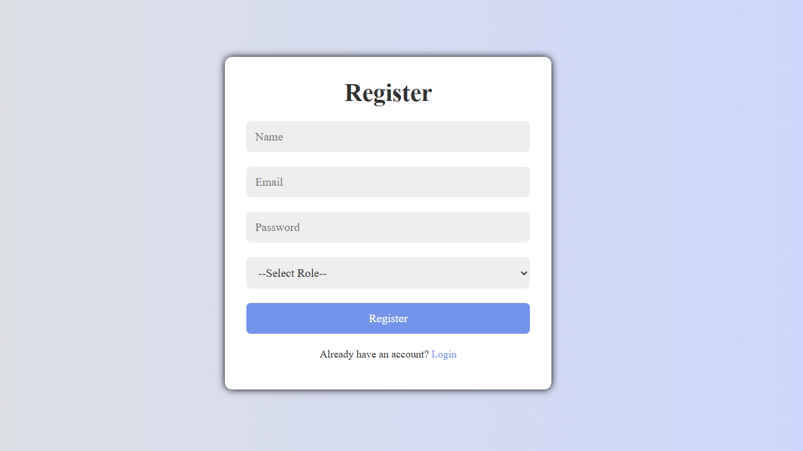

# Login & Registration System using PHP and MySQL

## 📌 Project Overview
This project is a session-based login and registration system developed using HTML, CSS, JavaScript, PHP, and MySQL with role-based access (Admin/User).

## 🛠 Technologies Used
- HTML
- CSS
- JavaScript
- PHP
- MySQL
- XAMPP Server

## ✨ Features
- User Registration
- User Login
- Admin Login
- Session Management
- Password Hashing
- Logout System
- Admin Dashboard
- User Dashboard

## 🗄 Database Structure
Database Name: users_db  
Table Name: users  

| Column | Type |
|-------|------|
| id | INT (Primary Key) |
| name | VARCHAR |
| email | VARCHAR |
| password | VARCHAR |
| role | VARCHAR |

## ▶️ How to Run
1. Install XAMPP/WAMP
2. Start Apache and MySQL
3. Import `database.sql` into phpMyAdmin
4. Place project folder in `htdocs`
5. Open browser and go to:
   http://localhost/php-login-registration-system

## 📸 Screenshots

### Login Page

### Register Page

### Admin Dashboard

### User Dashboard

## 👨‍💻 Author
Swaraj Ingale
